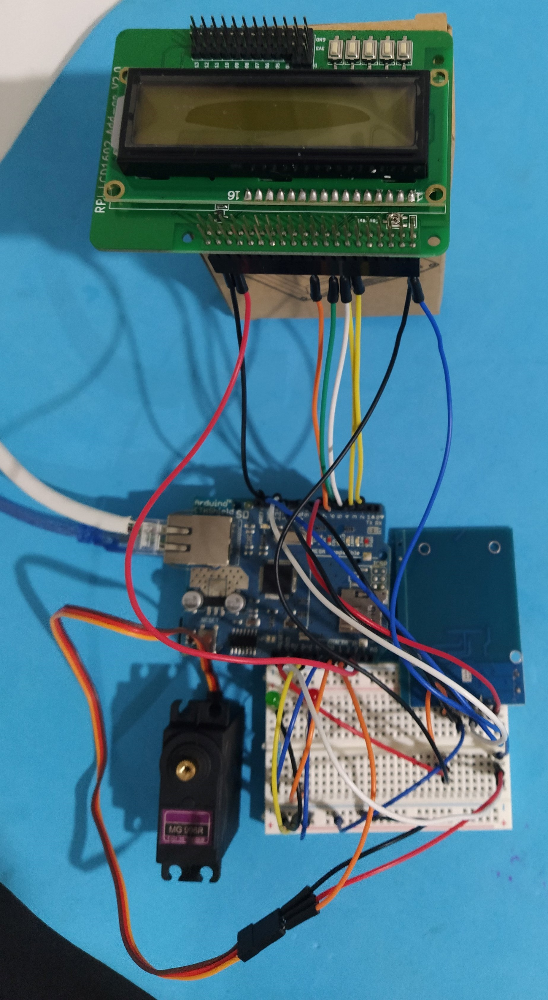

# trabalhoSETR_G13 - LESI - IPCA

Projeto desenvolvido para a disciplina de Sistemas Embebidos e em Tempo Real.

Esta disciplina faz parte do terceiro ano curricular da Licenciatura em Engenharia de Sistemas Informáticos.

## Colaboradores

Este trabalho contou com a colaboração dos seguintes alunos:

- 6160 - Renato Dantas
- 7526 - Jorge Guedes
- 17214 - João Morais

## Contextualização do Trabalho

Para o trabalho prático final, deverá ser realizado um projeto que consistirá no desenvolvimento de um sistema em tempo real que possa ser utilizado como resposta a uma necessidade específica.

Para a execução deste trabalho, escolhemos desenvolver um sistema que permita a marcação e controlo de ponto, assim como o controlo de acesso a espaços fisicos de uma empresa.

### Objetivos

- Construir um sistema embebido e em tempo real, baseado no Arduino;
- Criação e implementação de código de suporte ao funcionamento do sistema;
- Utilização de dispositivos de suporte (leitor RFID, Servo e LCD);
- Suporte a comunicação através de HTTP;

## Descrição da arquitetura do sistema

Para a execução deste projeto, o sistema deveria de preencher os seguintes requisitos:

- Comunicar com a Internet;
- Ler cartões RFID;
- Simular a abertura da fechadura da porta;
- Ter um indentificador visual, para facilmente perceber se foi autorizado ou não;
- Ter um display que mostrasse as informações do sistema;

Como tal, utilizamos os seguintes componentes:

- 1 Placa do Arduino;
- 1 Ethernet Shield;
- 1 Leitor RFID RC522;
- 1 LCD de 2 Linhas;
- 2 Leds e 2 Resistências, 1 vermelho e outro verde;
- 1 Servo;

